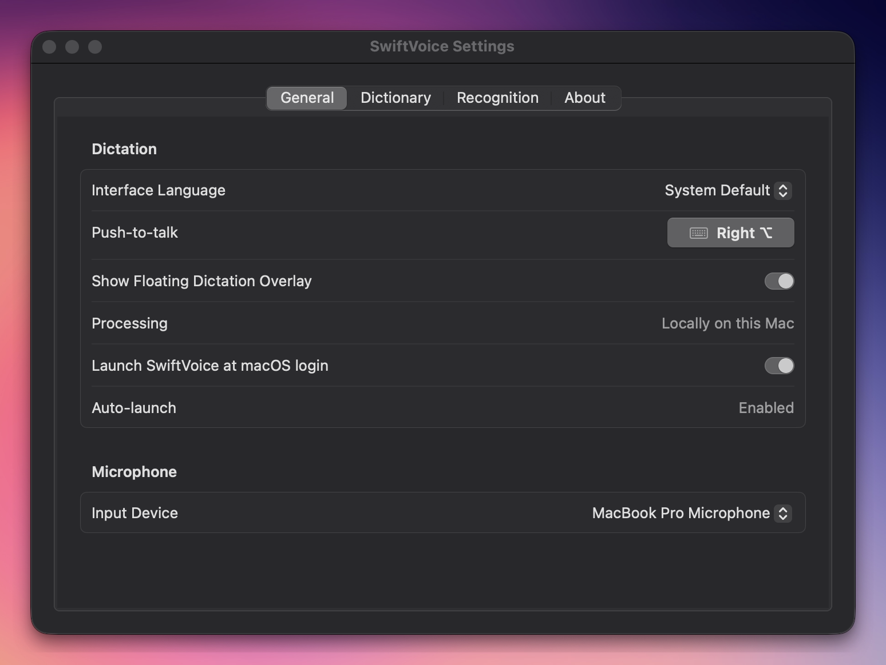
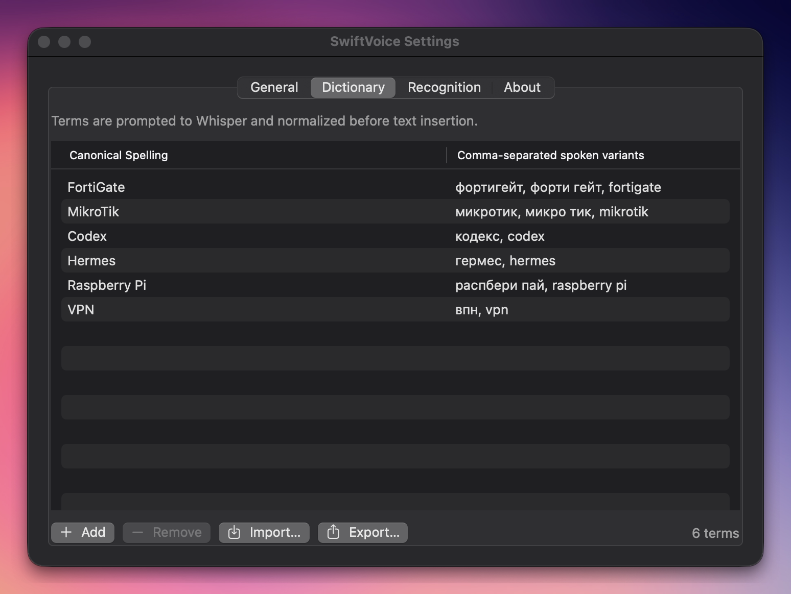
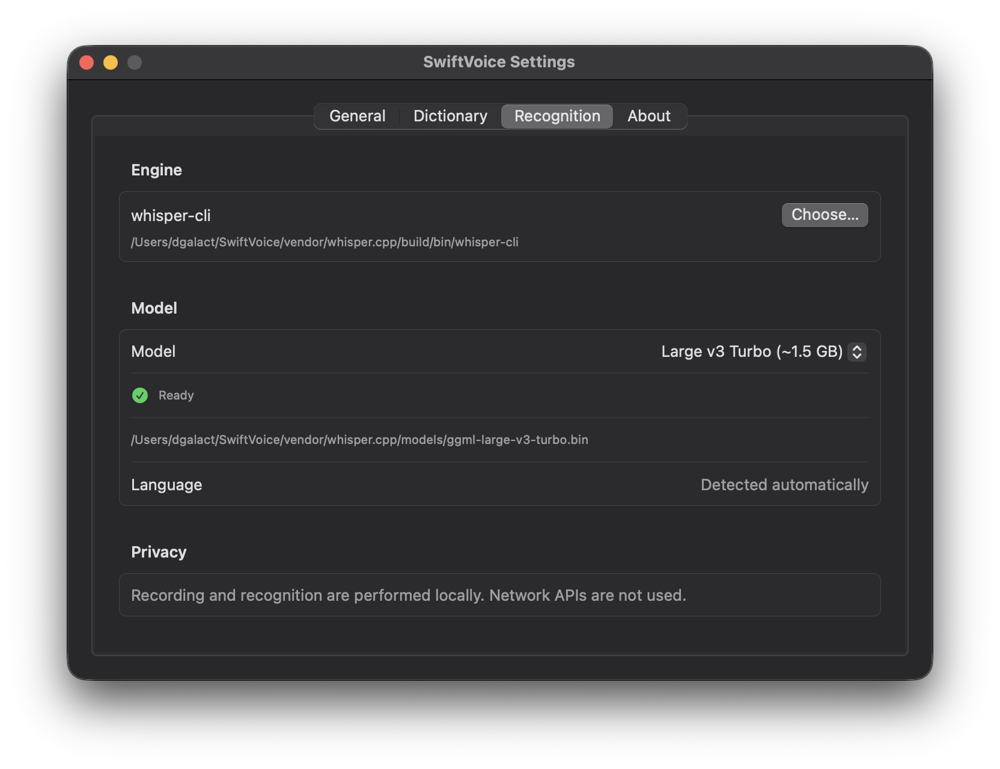
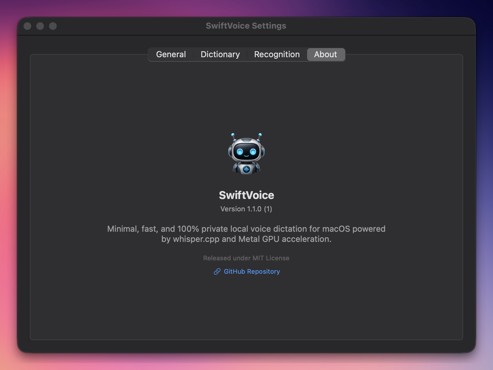

# SwiftVoice

> A minimal, fast, and 100% private local Push-to-Talk voice dictation app for macOS powered by `whisper.cpp` and Apple Metal GPU acceleration.

🌐 **Language:** [English](README.md) | [Українська](README_UK.md) | [Русский](README_RU.md)

---

```text
Hold Hotkey (e.g. Right ⌥ or ⌘B) → Floating Live Waveform HUD → Release → whisper.cpp → Text injected
```

Audio recording and speech recognition take place entirely on your Mac. SwiftVoice uses no external network APIs, stores no dictation history, and does not listen to your microphone in the background.

## 📸 Screenshots

<div align="center">
  
  
  <br/><br/>
  
  
  <br/><br/>
  
</div>

---

## ✨ Features

- **Push-to-Talk Dictation**: Hold your hotkey to record audio, release to transcribe and automatically type text into whichever application is currently focused.
- **Audio File Transcription**: Choose or drop a WAV, M4A, MP3, or AAC file, transcribe it locally without the personal dictation dictionary, then edit, copy, or save the result as UTF-8 text.
- **Floating Dictation HUD Overlay**: Glassmorphic pill window near the top of the display with real-time audio level waveform animations during dictation (can be toggled in Settings).
- **In-App Whisper Model Selector & Downloader**: Easily switch between 6 official Whisper models (`Tiny`, `Base`, `Small`, `Medium`, `Large v3`, `Large v3 Turbo`) or custom files. Download missing models directly inside Settings with progress tracking.
- **Custom Hotkey Recorder**: Bind any single modifier (`Right ⌥`, `Left ⌃`, `Fn`) or key combination (`⌘B`, `⌥Space`, `⌃Shift+V`) with real-time macOS system conflict detection.
- **Dictionary Import & Export**: Full **JSON** and **CSV/TXT** import and export support for backing up, sharing, or restoring custom vocabulary terms and aliases.
- **Acoustic Echo Cancellation (AEC)**: Apple Native Voice Processing automatically filters out background media (YouTube, Spotify, video players) playing through Mac speakers during dictation without modifying system volume.
- **Seamless AirPods & Headset Support**: Instant dictation activation with 0ms audio dropouts, zero background music playback stutter, and full support for closed MacBook lid (clamshell mode) with external displays.
- **Dynamic Microphone Route Recovery**: CoreAudio route monitoring automatically updates active microphone routes when plugging or unplugging AirPods, headsets, or USB microphones.
- **Multi-Language UI**: Full localization support for English, Russian, Ukrainian, and System Default with instant UI/menu updates.
- **Native macOS Experience**: Built natively using Swift 6 & SwiftUI. Features menu bar status indicator, microphone device switcher, native launch-at-login (`SMAppService`), and About window.

---

## 📋 Requirements

- macOS 14.0 (Sonoma) or newer on Apple Silicon (M1/M2/M3/M4).
- Xcode Command Line Tools (`xcode-select --install`).
- CMake.
- Git.

---

## 🚀 Quick Start (Automated Setup)

1. Clone the repository:
   ```bash
   git clone https://github.com/dgalact/SwiftVoice.git
   cd SwiftVoice
   ```

2. Run setup:
   ```bash
   chmod +x scripts/*.sh
   ./scripts/setup.sh
   ```
   *The `setup.sh` script automatically compiles `whisper.cpp` with Metal acceleration, builds SwiftVoice, and installs it to `/Applications/SwiftVoice.app`. You can select or download your preferred Whisper model directly inside the app Settings.*

3. Launch SwiftVoice:
   ```bash
   open "/Applications/SwiftVoice.app"
   ```

4. Grant macOS Permissions when prompted:
   - **Microphone**: Required for audio capture during dictation.
   - **Accessibility**: Required to inject recognized text into active applications.

---

## 🛠️ Build & Installation Scripts

### Build Application
```bash
./scripts/build-app.sh
open "dist/SwiftVoice.app"
```

### Install Application
```bash
./scripts/install-app.sh
open "/Applications/SwiftVoice.app"
```

### Bootstrap `whisper.cpp`
```bash
./scripts/bootstrap-whisper.sh
```
*Cleanly removes `vendor/whisper.cpp/build` before configuring CMake to ensure clean builds.*

---

## ⚙️ Configuration

Open Settings via the Menu Bar icon, `Command+,`, or by opening `SwiftVoice.app` again.

- **General**: Interface Language picker, interactive Push-to-Talk hotkey recorder, Floating Dictation Overlay toggle, Launch-at-Login toggle, and active microphone selector.
- **Dictionary**: Custom domain terminology, alias replacements, and **Import/Export** buttons (JSON & CSV).
- **Recognition**: In-app Whisper model selector & downloader, paths to `whisper-cli` executable and model file, language selection, and privacy information.
- **Transcription**: Local WAV/M4A/MP3/AAC file transcription with an editable result, Copy, and Save TXT actions. The personal dictation dictionary is intentionally not applied.
- **About**: Version information (`v1.2.0`), license details, and project repository links.

The dictionary file is stored at:
```text
~/Library/Application Support/SwiftVoice/dictionary.json
```

---

## 📄 License

Distributed under the [MIT License](LICENSE).
